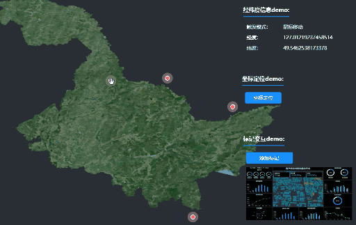

# 地图大屏自定义组件指南


## 开始之前

组件是 `地图大屏` 重要的组成部分。 `地图大屏` 自身为用户提供了丰富组件。
为了满足多样需求， `地图大屏` 也支持用户自定义组件，

## 开发要求

自定义组件的开发需要用到 `Vue.js`。

> 在开始之前，推荐先学习 [Vue.js](https://cn.vuejs.org/)。官方指南假设你已了解关于 [单文件组件](https://cn.vuejs.org/v2/guide/single-file-components.html) 和 [事件侦听器](https://cn.vuejs.org/v2/guide/components.html#%E7%9B%91%E5%90%AC%E5%AD%90%E7%BB%84%E4%BB%B6%E4%BA%8B%E4%BB%B6) 的知识。

## 开发步骤

1. 克隆项目文件

``` bash
git clone https://github.com/SuperMap/mapdashboard-custom-components
```

下载后的目录结构

``` bash
├── build
├── src
├── static
├── README.md
├── package.json
```

2. 在 src 目录下创建功能组件 <a href="#%E7%BC%96%E5%86%99%E5%8A%9F%E8%83%BD%E7%BB%84%E4%BB%B6">Component.vue</a>

3. 在 src 目录下创建属性组件 <a href="#%E7%BC%96%E5%86%99%E5%B1%9E%E6%80%A7%E7%BB%84%E4%BB%B6">Setting.vue</a> （如果不需要在地图大屏里进行属性配置，可忽略）

4. 在 src 目录下修改配置文件进行注册 <a href="#%E7%BC%96%E5%86%99%E9%85%8D%E7%BD%AE%E6%96%87%E4%BB%B6">components.json</a>

5. 如果存在多个自定义组件，建议在 src 目录下新增一个目录。

以上步骤完成的目录结构如下：

``` bash
├── src
│ ├── CustomComponent1      # 自定义组件1
│ │ ├── Component.vue       # 功能组件
│ │ └── Setting.vue         # 属性组件
│ ├── CustomComponent2      # 自定义组件2
│ │ └── Component.vue       # 功能组件
│ ├── components.json       # 配置文件
```

## 安装依赖

```bash
# install dependencies
npm install
```

## 启动调试

```bash
# serve with hot reload at localhost:8080 or other port
npm start / npm run dev
```

启动完成后，在 `地图大屏` 左侧组件列表自定义分类中可以看到自定义组件。

> 注意：这里需要 SuperMap iPortal 中的地图大屏作为调试环境，因此需要指定 SuperMap iPortal 的服务地址，请在 build/webpack.dev.conf.js 文件中对 iportalUrl 变量进行配置。

```js
// 请指定 SuperMap iPortal 服务地址
const iportalUrl = 'http://localhost:8190/iportal';
```

> 注意：由于开发环境端口和 SuperMap iPortal 服务端口不一致，服务访问会存在跨域问题，请打开 %IPORTAL_HOME%/webapps/iportal/WEB-INF 目录下的 web.xml 进行如下配置。

```xml
<init-param>
  <param-name>cors.allowed.origins</param-name>
  <!-- 请将端口设置为开发环境使用的端口 -->
  <param-value>http://localhost:8081</param-value>
</init-param>

<init-param>
    <param-name>cors.support.credentials</param-name>
    <param-value>true</param-value>
</init-param>
```

## 编译自定义组件

```bash
# build for production with minification
npm run build
```

执行 `npm run build`，将开发的 自定义组件 编译成相应的 js 文件。

## 使用自定义组件

将 `dist` 目录下的内容拷贝至目录 `%IPORTAL_HOME%/webapps/iportal/resources/mapDashboard/customComponents` 打开 SuperMap iPortal 中的地图大屏，刷新页面，在左侧组件列表自定义分类中可以看到自定义组件。

<hr />

## 编写功能组件

#### 生命周期
如果地图组件需要和地图交互，则需要编写组件的生命周期，从而获取地图实例，说明如下：

**loaded(map)**：

- **类型**： `Function`
- **参数**： `map`
- **描述**： 在组件关联的地图加载完成时，即地图实例初始化之后被调用。
- **详细**： 在该生命周期中，可拿到 `map` 实例编写相应的功能。

```js
loaded(map) {
  //  注意：this.map 不能在 $data 中定义，因为 map 实例不能作为响应式数据
  this.map = map;
}
```

**removed(map)**：

- **类型**： `Function`
- **参数**： `map`
- **描述**：在组件关联的地图销毁之前被调用。
- **详细**：在该生命周期中，应当清除与 `map` 有关的操作，如：清除添加过的图层、移除所有的监听器以及重置与 `map` 相关的变量等。

## 编写属性组件

如果要在 `地图大屏` 中对自定义组件进行属性配置，需要编写 `Setting.vue`。

#### 自定义属性

当前配置组件的 `props` 对象对应于功能组件中定义的 `props`对象 。每一个配置项的改动需要分发（`$emit`） `change` 事件，值以 `key-value` 键值对形式进行传递。

``` html
<template>
  <div>
    <div class="sm-setting-panel">
      <div class="sm-setting-panel__header">属性名：</div>
      <a-select
        class="sm-setting-panel__content"
        <!-- 绑定字段 -->
        :value="mode"
        <!-- 指定属性值 -->
        :options="optionsList"
        :getPopupContainer="triggerNode => triggerNode.parentNode"
        <!-- 这里必须分发 change 事件 -->
        @change="val => handleChange({ mode: val })"
      />
    </div>
  </div>
</template>

<script>
export default {
  props: {
    mode: String
  },
  data() {
    return {
      optionsList: [
        {
          label: '属性值1',
          value: 'value1'
        },
        {
          label: '属性值2',
          value: 'value2'
        }
      ]
    };
  },
  methods: {
    handleChange(data) {
      this.$emit('change', data);
    }
  }
};
</script>
```

#### 基础样式属性

 `地图大屏` 还提供了组件的部分基础样式属性，包括：

<ul>
  <li>
    <strong style="display: inline-block; width: 25%;">sm-setting-group</strong>：
    属性分组类名
  </li>
  <li>
    <strong style="display: inline-block; width: 25%;">sm-setting-group__title</strong>：
    属性分组标题类名
  </li>
  <li>
    <strong style="display: inline-block; width: 25%;">sm-setting-panel</strong>：
    属性容器类名
  </li>
  <li>
    <strong style="display: inline-block; width: 25%;">sm-setting-panel__header</strong>：
    属性标题类名
  </li>
  <li>
    <strong style="display: inline-block; width: 25%;">sm-setting-panel__content</strong>：
    属性组件类名
  </li>
  <li>
    <strong style="display: inline-block; width: 25%;">sm-setting-unit</strong>：
    属性组件单位类名
  </li>
  <li>
    <strong style="display: inline-block; width: 25%;">x-setting-line</strong>：
    分割线类名
  </li>
</ul>

``` html
<template>
  <div class="sm-setting-group">
    <div class="sm-setting-panel">
      <div class="sm-setting-panel__header">字体大小：</div>
      <div class="sm-setting-panel__content">
        <a-input :value="fontSize" @change="e => $emit('change', { fontSize: e.target.value })" />
        <span class="sm-setting-unit">像素</span>
      </div>
    </div>
  </div>
</template>
```

## 编写配置文件

每个自定义组件都需要在根目录下的 `components.json` 文件中进行注册，内容举例如下：

``` json
{
  "CustomComponent": {
    "name": "组件名称",
    "type": "CustomComponent",
    "defaultProps": {
      "mode": "value1"
    },
    "uri": "CustomComponent1/Component",
    "settingUri": "CustomComponent1/Setting"
  }
}
```

字段说明：

**name**：

- **类型**： `String`
- **必填**： `是`
- **详细**： 组件显示名称

**type**：

- **类型**： `String`
- **必填**： `是`
- **详细**： 组件类型

**defaultProps**：

- **类型**： `Object`
- **必填**： `否`
- **详细**： 属性配置项的默认值

**uri**：

- **类型**： `Object`
- **必填**： `是`
- **详细**： 功能组件的相对路径

**settingUri**：

- **类型**： `String`
- **必填**： `是`
- **详细**： 属性组件的相对路径
